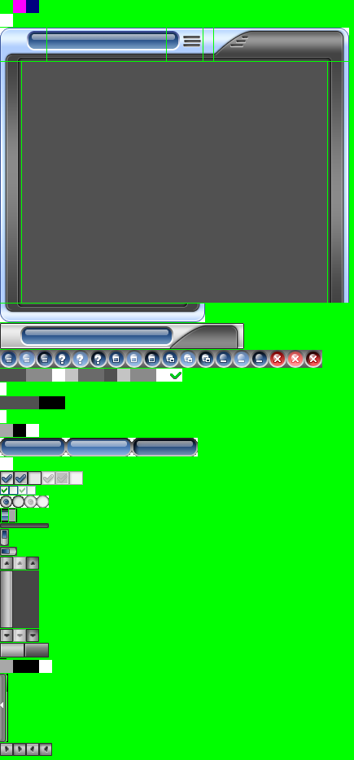
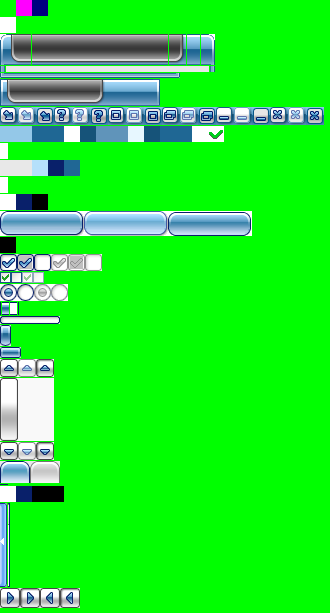
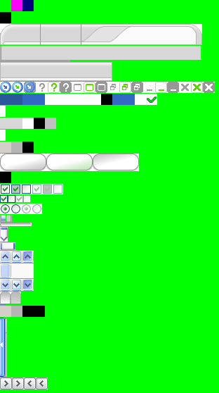

# VideoConverter
This is a sample of how using ffmpeg to convert videos. The Project uses of wxWidgets/C++ and supports customized window frames.

The window frame can be customized with a picture, and color can be defined in a xml file. Samples: 
 
 
 
